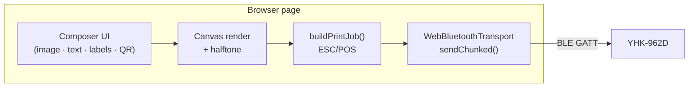

# Architecture

## Overview

This project prints to YHK-series mini thermal printers (tested against YHK-962D) from a browser page over Web Bluetooth. There is no backend: composing, dithering and ESC/POS encoding all happen in the tab, which then writes the bytes straight to the printer's GATT characteristic.



## Pages

| Page | Entry | Purpose |
|------|-------|---------|
| `index.html` | `src/main.ts` | Print Studio — a free-form canvas of text, image, sticker, QR and rule elements |
| `qr.html` | `src/qr.ts` | QR codes with URL / text / Wi-Fi payload presets |

Both share the connection UI (`src/ui/connection.ts`), the transport, and the `shared/` encoding modules.

## Studio document model

A page is `{ elements[], border, bottomMargin, minHeight }` (`src/studio/types.ts`). Every element carries `x`, `y`, `width`, `height` and `rotation` in printer dots, plus its own type-specific fields. Painting order is array order, so z-ordering is a splice.

Page height is derived, never stored: `documentHeight()` takes the lowest rotated element bound, adds the bottom margin, and clamps to `[minHeight, 4000]`. Moving an element up shortens the paper; dragging one down lengthens it.

Text is the one element whose height is computed rather than set — `layoutText()` wraps to the box width, so `elementHeight()` is what bounds, hit-testing and stacking all use.

## PrinterTransport

Print encoding stays platform-agnostic behind one interface:

```typescript
interface PrinterTransport {
  readonly connected: boolean;
  connect(): Promise<void>;
  disconnect(): Promise<void>;
  send(data: Uint8Array): Promise<void>;
}
```

`WebBluetoothTransport` is the only implementation: it runs the device picker, resolves the ISSC service and TX characteristic, prefers acknowledged writes when the characteristic advertises them, and paces chunks through `sendChunked()`.

Shared modules:

- `escpos.ts` — ESC/POS command encoding (`ESC @`, density, `GS v 0` raster, feed)
- `halftone.ts` — grayscale conversion, tone adjustments, halftone algorithms
- `send-chunked.ts` — chunk pacing with a post-job flush delay

## Render pipeline

`renderPage()` (`src/studio/render.ts`) composes the whole page at 1:1 and hands back both the 1-bit canvas and the `boolean[][]` the encoder wants.

1. **Page** — a white canvas 384 dots wide and `documentHeight()` tall.
2. **Elements** — each one drawn under `translate(centre) → rotate → translate(-half)`:
   - *text* wraps and draws (or knocks out of a black block),
   - *sticker* renders on its own transparent buffer (several punch holes with `destination-out`, which would otherwise erase the page),
   - *QR* draws whole modules so cells survive thresholding,
   - *rule* strokes its style,
   - *image* is dithered at its placed size and cached by a key covering every tone setting.
3. **Border** — the frame is painted last, so ticket notches can punch through content.
4. **Threshold** — one pass over the composite turns antialiased edges into crisp dots. Pre-dithered images are already black and white, so only text and shape edges are affected.
5. **Encode** — `buildPrintJob(pixels, { feedLines })` → one `Uint8Array`, sent in paced 180-byte chunks.

Image elements themselves go through `src/studio/raster.ts`: crop → flip → stepped downscale → grayscale → auto-level, brightness, contrast, gamma, unsharp mask, invert → halftone.

## Editing

`src/studio/stage.ts` owns the interactive canvas. It renders the page at 2× and draws selection chrome on top, then maps pointer events back into page dots. Hit-testing and resizing both work in the element's unrotated frame (rotate the pointer by `-rotation` about the centre); after a resize the opposite handle is pinned in page space so rotated boxes grow the way you expect. Corner handles keep aspect for images and QR codes, and scale the font for text.

## Why browser-only

Web Bluetooth keeps the whole app static: no server to run, no data leaving the page, and GitHub Pages can host it. The trade-offs are real — Safari and iOS have no Web Bluetooth, the tab must be in BLE range, and one tab holds one connection — but for printing from a laptop or Android phone next to the printer, that is the whole story.
